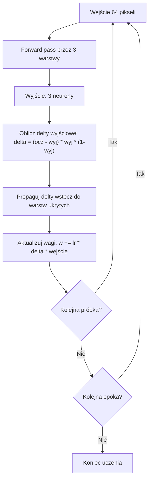

# Aplikacja do rozpoznawania literek E, F, Z (MLP + Backpropagation)

## Stan obecny

Istniejące klasy profesora (`Neuron`, `Warstwa`, `Siec`) implementują jedynie forward pass. `Test.java` to demo wizualizacji 2D profesora — **zostawiamy jako referencję, nie ruszamy**.

Nowe pliki dodane ręcznie:
- **`Main.java`** — nowy punkt wejścia aplikacji (`JFrame`). Zawiera szkielet GUI (`buildUI()`) i inicjalizację sieci z poprawną topologią `{8, 5, 3}` / 64 wejścia.
- **`PaintCanvasComponent.java`** — gotowy komponent siatki 8x8 (`JComponent`). Obsługuje klik (toggle) i drag (malowanie), `clear()`, `getContent()` → `double[64]`. Wymaga poprawki kolejności pikseli (patrz niżej).

## Topologia sieci

```
64 wejścia (siatka 8x8) → [8 neuronów] → [5 neuronów] → [3 neurony wyjściowe]
```

Wyjścia: `[E, F, Z]` — one-hot encoding, np. E = `[1, 0, 0]`, F = `[0, 1, 0]`, Z = `[0, 0, 1]`.

## Zmiany w istniejących klasach

### 1. Neuron.java

- Przełączyć inicjalizację wag na zakres `*0.01` (jak przygotował profesor w komentarzu "do projektu") — zakomentować linię `*10`, odkomentować linię `*0.01`. Dodać klamry `{}` do pętli `for` w `generuj()` dla czytelności.
- Dodać pole `double wyjscie` — przechowuje ostatni wynik (potrzebne do obliczenia pochodnej sigmoidy przy backprop).
- Zmodyfikować `oblicz_wyjscie()` tak, by zapisywało wynik do `this.wyjscie` przed `return`.
- Dodać pole `double delta` — błąd neuronu podczas backpropagation.

### 2. Warstwa.java

- Dodać pole `double[] ostatnieWejscia` — zapamiętuje wejścia warstwy (potrzebne przy aktualizacji wag).
- Zmodyfikować `oblicz_wyjscie()` żeby zapisywało `ostatnieWejscia = wejscia`.

> **Kopia vs referencja (`ostatnieWejscia`):** `ostatnieWejscia = wejscia` zapisuje referencję do tablicy przekazanej z zewnątrz. Jeśli wywołujący zmodyfikuje tę tablicę przed wykonaniem backpropu (np. nadpisze danymi następnej próbki), wagi zostaną zaktualizowane na błędnych wartościach, co jest trudne do wykrycia. **Zalecane:** zawsze używaj kopii obronnej: `ostatnieWejscia = Arrays.copyOf(wejscia, wejscia.length)`. Narzut jest pomijalny (64 lub kilka elementów), a eliminuje cały problem.

### 3. Siec.java

- Pole `pierwszeWejscia` **nie jest potrzebne** — każda `Warstwa` przechowuje swoje `ostatnieWejscia`, więc `warstwy[0].ostatnieWejscia` to oryginalne wejścia sieci.
- Dodać metodę `double ucz(double[] wejscia, double[] oczekiwane, double lr)` implementującą **backpropagation** (zwraca MSE próbki):
  1. **Forward pass** — `oblicz_wyjscie(wejscia)`
  2. **Oblicz delty warstwy wyjściowej** — dla każdego neuronu `i` w ostatniej warstwie:
     ```java
     double o = neuron.wyjscie;
     neuron.delta = (oczekiwane[i] - o) * o * (1.0 - o);
     ```
  3. **Propaguj delty wstecz** — dla warstw ukrytych (od przedostatniej do pierwszej): delta neuronu `j` w warstwie `l` = `o * (1 - o) * Σ(delta_k * waga_k_j)` (sumowanie po neuronach warstwy `l+1`).
  4. **Aktualizuj wagi** — dla każdej warstwy, każdego neuronu:
     ```java
     wagi[0] += lr * delta;              // bias
     wagi[i] += lr * delta * wejscie[i-1]; // reszta wag
     ```
     > **Konwencja znaku (`+=` vs `-=`):** delta jest zdefiniowana jako `(target - o) * o*(1-o)` — znak jest już „w kierunku obniżenia błędu". Dlatego poprawna aktualizacja to `+=`. Gdyby ktoś zmienił definicję delty na `(o - target) * ...`, konieczne byłoby `-=`. **Tych konwencji nie wolno mieszać** — zamiana znaku przy tej samej definicji delty odwraca gradient i sieć nigdy nie będzie się uczyć.
- Dodać metodę `double uczEpoka(double[][] dane, double[][] oczekiwane, double lr)` — iteruje po wszystkich próbkach, mieszając kolejność przed każdą epoką (`shuffle`). Zwraca średnie MSE epoki (potrzebne do wykresu).

### Definicja MSE (spójność `ucz` / `uczEpoka` / wykres)

- **MSE jednej próbki** (wartość zwracana przez `ucz()`): średnia kwadratu błędu po **3 wyjściach**:
  - `mseProbka = (1/3) * Σ_{k=0}^{2} (oczekiwane[k] - wyjscie[k])²`
- **MSE epoki** (wartość zwracana przez `uczEpoka()`): średnia MSE po **wszystkich próbkach** w epoce:
  - `mseEpoka = (1/N) * Σ_{n=0}^{N-1} mseProbka(n)`
- Ten sam wzór używany przy logowaniu i na wykresie MSE — bez mieszania sumy ze średnią.

### Indeksacja wag przy propagacji wstecznej

W `Neuron`: `wagi[0]` = bias, `wagi[1..liczba_wejsc]` odpowiadają wejściom `wejscia[0]..wejscia[liczba_wejsc-1]` (czyli wyjściom poprzedniej warstwy).

Przy obliczaniu delty neuronu `j` w warstwie `l` (indeks w tej warstwie) od neuronów warstwy `l+1` (indeks `k`):

- Waga z wyjścia `j` warstwy `l` do neuronu `k` warstwy `l+1` to **`neuron_k.wagi[j + 1]`** (bo `j+1` to indeks w tablicy wag odpowiadający `j`-temu wejściu).

Suma w kroku propagacji: po wszystkich `k` w warstwie `l+1`: `Σ_k delta_k * neuron_k.wagi[j + 1]`.

### Kolejność kroków w `ucz()`

1. Forward pass (zapis `ostatnieWejscia` w warstwach, `wyjscie` w neuronach).
2. Obliczyć **wszystkie** delty od warstwy wyjściowej w dół do pierwszej.
3. Dopiero potem **zaktualizować wszystkie wagi** (żeby delty wyższych warstw liczyły się na starych wagach).

### Shuffle przed epoką

- Nie mieszać osobno tablic `dane` i `oczekiwane` niezależnie (rozjadą się pary).
- **Poprawnie:** utworzyć listę indeksów `0..N-1`, wykonać `Collections.shuffle` na tej liście, następnie iterować próbki w kolejności `indeksy[i]` — tak samo dla `dane` i `oczekiwane`.

### Wczesne zatrzymanie / guard rails *(opcjonalne, non-MVP)*

Poniższe mechanizmy **nie są wymagane w MVP**, ale warto je uwzględnić w przyszłości:

- **Plateau MSE:** jeśli `mseEpoka` nie spada o więcej niż ε (np. `1e-6`) przez K kolejnych epok (np. K=50), zatrzymaj uczenie i wyświetl komunikat „MSE ustabilizowane".
- **Limit czasu:** maksymalny czas uczenia (np. 60 s) po którym `SwingWorker` kończy pętlę — zapobiega zawieszeniu GUI przy bardzo dużych datasetach lub małym LR.
- **Minimalne MSE:** opcjonalny próg docelowy — przerwij wcześniej gdy `mseEpoka < mseDocelowe` (konfigurowalne przez użytkownika).

Można dodać te opcje jako dodatkowe pola w panelu sterowania (np. `JCheckBox "Wczesne zatrzymanie"` + pole tekstowe z progiem) — bez wpływu na resztę logiki MVP.

## GUI — Main.java (rozbudowa istniejącego szkieletu)

Rozbudować `Main.java` (nie `Test.java` — ten zostawiamy). Okno podzielone na dwie kolumny (lewy panel + prawy panel). Lewy panel podzielony horyzontalnie na dwie sekcje.

**Pole sieci:** w kodzie może nazywać się np. `mlpNetwork` (jak w szkielecie) — w planie oznacza instancję `Siec`.

**Layout (Swing):** prosty wariant — główne okno `BorderLayout` lub `JSplitPane` (lewo/prawo); lewa kolumna `JSplitPane` pionowy (góra: rysowanie, dół: sterowanie) albo dwa panele w `BorderLayout.NORTH` / `SOUTH`; prawa kolumna `BorderLayout` (logi `NORTH`, wyjścia neuronów `CENTER`, dół: dwa `JPanel` obok siebie w kontenerze z `GridLayout(1,2)` lub zagnieżdżony `JSplitPane`). Celem jest czytelny podział bez `GridBagLayout`, chyba że będzie potrzebny.

### Layout okna

```
┌───────────────────────────────────────┬───────────────────────────────────────┐
│  LEWY PANEL                          │  PRAWY PANEL                          │
│                                       │                                       │
│  ┌─ GÓRA (rysowanie + zgadywanie) ──┐│  ┌──────────────────────────────────┐ │
│  │                                   ││  │         Panel logów              │ │
│  │  ┌────────────┐                   ││  │  (JTextArea + JScrollPane)       │ │
│  │  │            │  [Zgadnij]       ││  │  auto-scroll na dół              │ │
│  │  │  Siatka    │  [Wyczyść]       ││  └──────────────────────────────────┘ │
│  │  │  8 x 8     │                   ││                                       │
│  │  │            │  Wynik: E         ││  ┌─ Wyjścia sieci ─────────────────┐ │
│  │  └────────────┘                   ││  │  ● E: 0.97   ○ F: 0.03   ○ Z: 0.01│
│  └───────────────────────────────────┘│  └──────────────────────────────────┘ │
│                                       │                                       │
│  ┌─ DÓŁ (uczenie + testowanie) ─────┐│  ┌──────────────┐  ┌──────────────┐  │
│  │                                   ││  │ Wykres MSE   │  │ Wykres acc.  │  │
│  │  Epoki: [========■====] 1000     ││  │ (uczenie)    │  │ (testowanie) │  │
│  │  LR:    [==■==========] 0.10     ││  │ line chart   │  │ bar chart    │  │
│  │  [Ucz]  [Testuj]  [Reset sieć]  ││  └──────────────┘  └──────────────┘  │
│  │                                   ││                                       │
│  │  ○ E  ○ F  ○ Z                   ││                                       │
│  │  [Dopisz do ciągu uczącego]      ││                                       │
│  └───────────────────────────────────┘│                                       │
└───────────────────────────────────────┴───────────────────────────────────────┘
```

### Lewy panel — góra (rysowanie + zgadywanie)

- **Siatka 8x8** — użyć istniejącego `PaintCanvasComponent(8)`. Komponent już obsługuje klik (toggle), drag (malowanie), `clear()` i `getContent()`.
- **Poprawka row-major w `PaintCanvasComponent.java`** — obecnie `canvas[i][j]` traktuje `i` jako kolumnę i `j` jako wiersz, a `getContent()` serializuje column-major (`i*8+j`). Trzeba ujednolicić do **row-major**: zamienić konwencję w `paintComponent` i `paintEventHandler` tak, aby `canvas[row][col]`, a `getContent()` dawało `fields[row*8 + col]`. Dzięki temu kolejność pikseli jest spójna z CSV (wiersz po wierszu, od góry do dołu).

  **Mini-test manualny (weryfikacja row-major po poprawce):**
  | Akcja | Oczekiwany wynik |
  |-------|-----------------|
  | Kliknij tylko piksel `[row=0, col=0]` (lewy górny róg) | `getContent()[0] == 1.0`, pozostałe `== 0.0` |
  | Wyczyść; kliknij `[row=0, col=1]` (drugi od lewej, górny rząd) | `getContent()[1] == 1.0` |
  | Wyczyść; kliknij `[row=1, col=0]` (pierwszy w drugim rzędzie) | `getContent()[8] == 1.0` |
  | Wyczyść; kliknij `[row=7, col=7]` (prawy dolny róg) | `getContent()[63] == 1.0` |

  Testy te pozwalają wykryć regresję (odwróconą kolejność), bo wizualnie komponent może nadal wyglądać poprawnie, a wektor wejściowy do sieci byłby przesunięty.
- **Przycisk "Zgadnij"** — `paintCanvas.getContent()` → `mlpNetwork.oblicz_wyjscie(...)` → ta sama reguła klasyfikacji co w sekcji **„Obsługa nierozpoznania i reguła predykcji (Zgadnij + Test)”** (np. wspólna metoda `predictLetter`).
- **Przycisk "Wyczyść"** — wywołuje `paintCanvas.clear()` (obok Zgadnij).
- **Label "Wynik"** — wyświetla rozpoznaną literę lub "Nie rozpoznano".

### Lewy panel — dół (uczenie + testowanie + dopisywanie)

- **Slider epok** — `JSlider` zakres 100–10000, domyślnie 1000, krok 100. Obok `JLabel` z aktualną wartością (aktualizowany `ChangeListener`).
- **Slider learning rate** — `JSlider` zakres 1–100 (mapowany na 0.01–1.0), domyślnie 10 (= 0.1). Obok `JLabel` z aktualną wartością. Pozwala eksperymentować z prędkością uczenia.
- **Przycisk "Ucz"** — wczytuje `dane_uczace.csv`, uruchamia uczenie w `SwingWorker` (nie blokuje GUI). **Wielokrotne kliknięcie kontynuuje uczenie** istniejącej sieci (dokłada epoki, wykres MSE dopisuje punkty). Reset sieci = osobny przycisk. Po zakończeniu — `JOptionPane.showMessageDialog` z podsumowaniem (epoki, lr, MSE końcowe, czas).
- **Przycisk "Testuj"** — wczytuje `dane_testowe.csv`, forward pass, liczy accuracy per klasa. **Reguła predykcji musi być identyczna jak przy „Zgadnij”** (patrz sekcja poniżej), żeby wynik testu i ręczne zgadywanie były spójne. Po zakończeniu — `JOptionPane.showMessageDialog` z wynikiem (E=X%, F=X%, Z=X%, TOTAL=X%).
- **Przycisk "Reset sieć"** — tworzy nową instancję `Siec` z losowymi wagami (ta sama topologia 64→8→5→3). **Czyści wykres MSE, wykres accuracy i panel logów** (świadoma decyzja: czysty start). Pozwala zacząć uczenie od zera bez restartu aplikacji.
- **Radio buttony E/F/Z + "Dopisz"** — pobiera siatkę + wybraną literę → dopisuje wiersz do `dane_uczace.csv`.

### Prawy panel — panel logów

- `JTextArea` (nieedytowalny) w `JScrollPane`, auto-scroll na dół.
- Metoda `log(String msg)` dopisuje linię z timestampem `[HH:mm:ss]`.
- Przykładowe wpisy:
  - `[12:34:56] Start uczenia, epoki=1000, lr=0.1`
  - `[12:34:56] Epoka 100/1000, MSE=0.0342`
  - `[12:34:57] Koniec uczenia, MSE końcowe=0.0012`
  - `[12:34:58] Test: E=100%, F=80%, Z=100%, TOTAL=93%`
  - `[12:34:59] Zgadywanie: [0.98, 0.01, 0.03] -> E`

### Prawy panel — wyjścia neuronów

Kompaktowy panel pokazujący wartości 3 neuronów wyjściowych po kliknięciu "Zgadnij":

```
● E: 0.97    ○ F: 0.03    ○ Z: 0.01
```

- **Spójność z `predictLetter`:** który neuron jest „zwycięzcą” wizualnie musi odpowiadać literze zwróconej przez tę samą logikę co w sekcji predykcji (żaden > 0.5 → brak zwycięzcy; w przeciwnym razie wybór jak w punktach 2–3 tamtej sekcji).
- Kropka zwycięzcy — zielona wypełniona (`fillOval`) przy wybranym neuronie.
- Pozostałe — szare puste kółka (`drawOval`).
- Gdy brak rozpoznania (żaden > 0.5) — wszystkie kropki czerwone.
- Implementacja: `JPanel` z `paintComponent` — trzy `fillOval`/`drawOval` + `drawString` dla etykiet i wartości.

### Prawy panel — wykres uczenia (MSE per epoka)

- **Line chart** — średni MSE po każdej epoce, krzywa opadająca = sieć się uczy.
- Klasa `WykresPanel extends JPanel` z `ArrayList<Double>`.
- `paintComponent`: na początku **`super.paintComponent(g)`** (wyczyści tło), potem osie (`drawLine`), etykiety (`drawString`), punkty łączone linią łamaną. To samo dla panelu z kropkami wyjść — unikamy nadpisywania rysunku przez domyślne malowanie, gdy komponent stanie się `opaque`.
- MSE epoki — zgodnie z sekcją „Definicja MSE” (średnia po wyjściach, potem średnia po próbkach).
- Wymaga zmiany sygnatury `uczEpoka()` na zwracającą `double` (MSE).
- **Odświeżanie GUI podczas uczenia:** co **1 epokę** dopisać punkt MSE do listy wykresu i wywołać `repaint()` na panelu wykresu. Log tekstowy (np. „Epoka k/…”) można rzadziej — np. co **10 epok** albo co **1%** całkowitej liczby epok — żeby nie zalać `JTextArea` i nie spowalniać EDT nadmiernie; `SwingWorker.publish()` / `process()`.

### Prawy panel — wykres testowania (accuracy per klasa)

- **Bar chart** — 4 słupki: E, F, Z, TOTAL (% poprawnych klasyfikacji).
- Ten sam wzorzec `WykresPanel`, ale rysuje `fillRect` + etykiety + wartości procentowe.
- Aktualizacja po kliknięciu "Testuj".

### Uczenie w osobnym wątku

- `SwingWorker` — pętla po epokach w `doInBackground()`, aktualizacja logów i wykresu przez `publish()`/`process()`.
- **Blokada przycisków** — na czas uczenia wyłączane (`setEnabled(false)`) są: Ucz, Testuj, Zgadnij, Dopisz, Reset. Wagi w trakcie uczenia są niestabilne, więc forward pass dałby niespójne wyniki.
- Po zakończeniu — przyciski odblokowane + `JOptionPane` z podsumowaniem.

### Obsługa błędów CSV

- Przy wczytywaniu `dane_uczace.csv` / `dane_testowe.csv` — `try/catch` na `FileNotFoundException` i `IOException`.
- W razie braku pliku: `JOptionPane.showMessageDialog` z komunikatem błędu (np. "Nie znaleziono pliku dane_uczace.csv") + log w panelu logów.
- Walidacja: sprawdzenie czy wiersz ma dokładnie 65 kolumn (64 piksele + etykieta) i czy etykieta to E/F/Z.

### Ścieżki do plików CSV

- Wczytywanie / dopisywanie: pliki **`dane_uczace.csv`** i **`dane_testowe.csv`** w **katalogu roboczym procesu** (zwykle katalog, z którego uruchamiasz `java`, np. root projektu przy `java -cp out Main` z katalogu głównego).
- Jeśli plik nie istnieje przy starcie — nie jest błędem; błąd dopiero przy „Ucz” / „Testuj” / „Dopisz” z komunikatem (patrz wyżej).
- Opcjonalnie na później: stała w kodzie lub prosty dialog wyboru pliku — na MVP wystarczy katalog roboczy + jasna informacja w README dla użytkownika.

## Format CSV

Plik `dane_uczace.csv` i `dane_testowe.csv`:

```
0,0,1,1,1,0,0,0,0,1,0,0,...(64 wartości)...,E
1,0,0,1,0,0,...(64 wartości)...,F
```

Każdy wiersz: 64 wartości (0/1) + etykieta (E/F/Z). Konwersja etykiety na one-hot w kodzie.

**Kolejność 64 wartości w CSV:** **row-major**, zgodnie z `PaintCanvasComponent.getContent()` po poprawce — pierwsze 8 liczb = pierwszy wiersz siatki od lewej, itd.

**Specyfikacja formatu (szczegóły):**
- **Separator:** zawsze przecinek (`,`). Inne separatory (średnik, tabulator) nie są obsługiwane.
- **Białe znaki:** niedozwolone — parser dzieli po `,` bez `trim()`. Spacja wokół wartości spowoduje błąd parsowania lub nieprawidłową wartość. Pliki generowane przez „Dopisz" muszą spełniać ten warunek automatycznie.
- **Dozwolone wartości pikseli:** `0` i `1` (liczby całkowite). Format `0.0`/`1.0` jest opcjonalnie tolerowany jeśli parser używa `Double.parseDouble()` zamiast `Integer.parseInt()`.
- **Zakończenie linii:** toleruj zarówno `LF` (`\n`, Unix) jak i `CRLF` (`\r\n`, Windows) — `BufferedReader.readLine()` obsługuje oba automatycznie.
- **Puste linie:** ignorowane — parser pomija wiersze, dla których `line.isBlank()` jest `true`.

## Pliki CSV z danymi

Treść plików `dane_uczace.csv` i `dane_testowe.csv` **dostarcza użytkownik** (ręcznie lub narzędziami). Aplikacja zakłada poprawny format (65 kolumn, etykieta E/F/Z) i waliduje wiersze; brak gotowych próbek w repozytorium nie blokuje implementacji.

## Obsługa nierozpoznania i reguła predykcji (Zgadnij + Test)

Wspólna funkcja pomocnicza `predictLetter(double[] wyjscieSieci)` (lub równoważna logika):

1. Jeśli **żaden** z 3 neuronów wyjściowych nie ma wartości **> 0.5** → wynik: brak klasy („Nie rozpoznano” w GUI; przy liczeniu accuracy tę próbkę licz jako **błędną** wobec etykiety).
2. Jeśli **dokładnie jeden** indeks ma wartość **> 0.5** → przewidywana litera to E / F / Z wg kolejności neuronów `[E, F, Z]`.
3. Jeśli **więcej niż jeden** ma **> 0.5** → wybierz indeks z **największą** wartością (argmax po całej trójce — remisy rzadkie; można rozstrzygać deterministycznie pierwszym max).

Ta sama reguła dla **„Zgadnij”** oraz przy **liczeniu accuracy w „Testuj”** (porównanie przewidywanej litery z etykietą w CSV).

## Diagram przepływu backpropagation



## Definition of Done

Poniższe kryteria muszą być spełnione, aby implementację uznać za ukończoną:

- [ ] **MSE maleje w czasie** — `uczEpoka()` zwraca `mseEpoka` i na typowym zbiorze uczącym wartość ta spada w kolejnych epokach (weryfikacja na wykresie lub w logach po ~100–500 epokach).
- [ ] **Spójna predykcja** — „Zgadnij" i „Testuj" wywołują tę samą metodę `predictLetter(double[])` (lub identyczną logikę); wynik klasyfikacji jest identyczny dla tych samych danych wejściowych.
- [ ] **GUI responsywne** — uczenie działa w `SwingWorker`; interfejs nie zawiesza się podczas uczenia; przyciski Ucz/Testuj/Zgadnij/Reset/Dopisz są blokowane na czas uczenia i odblokowywane po zakończeniu.
- [ ] **Row-major zweryfikowany** — `PaintCanvasComponent.getContent()` jest zgodne z konwencją row-major (zweryfikowane mini-testem manualnym z tabeli powyżej); kolejność pikseli jest spójna z CSV.
- [ ] **CSV wczytywane poprawnie** — parser obsługuje format zgodny ze specyfikacją (separator `,`, CRLF/LF, 65 kolumn, etykieta E/F/Z); wiersze z błędami są odrzucane z logiem zamiast crashować aplikację.
- [ ] **Reset działa czysto** — „Reset sieć" tworzy nową instancję `Siec` z losowymi wagami i czyści wykres MSE, wykres accuracy oraz panel logów.
