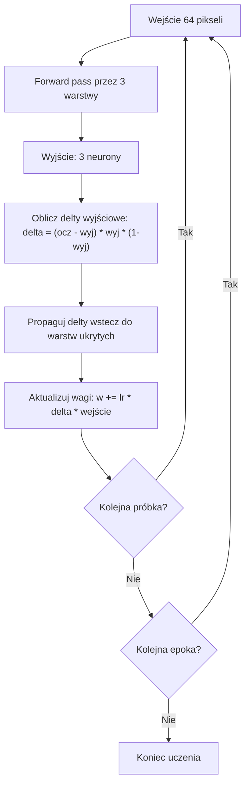

# Aplikacja do rozpoznawania literek E, F, Z (MLP + Backpropagation)

## Stan obecny

Istniejące klasy (`Neuron`, `Warstwa`, `Siec`) implementują jedynie forward pass. `Test.java` to demo wizualizacji 2D — zostanie zastąpiony nowym GUI. Trzeba dodać backpropagation i nowy interfejs.

## Topologia sieci

```
64 wejścia (siatka 8x8) → [8 neuronów] → [5 neuronów] → [3 neurony wyjściowe]
```

Wyjścia: `[E, F, Z]` — one-hot encoding, np. E = `[1, 0, 0]`, F = `[0, 1, 0]`, Z = `[0, 0, 1]`.

## Zmiany w istniejących klasach

### 1. Neuron.java

- Przełączyć inicjalizację wag na mały zakres (`*0.01` zamiast `*10`) — odkomentować linię 21, zakomentować linię 20.
- Dodać pole `double wyjscie` — przechowuje ostatni wynik (potrzebne do obliczenia pochodnej sigmoidy przy backprop).
- Zmodyfikować `oblicz_wyjscie()` tak, by zapisywało wynik do `this.wyjscie` przed `return`.
- Dodać pole `double delta` — błąd neuronu podczas backpropagation.

### 2. Warstwa.java

- Dodać pole `double[] ostatnieWejscia` — zapamiętuje wejścia warstwy (potrzebne przy aktualizacji wag).
- Zmodyfikować `oblicz_wyjscie()` żeby zapisywało `ostatnieWejscia = wejscia`.

### 3. Siec.java

- Dodać pole `double[] pierwszeWejscia` — zapamiętuje oryginalne wejścia sieci.
- Zmodyfikować `oblicz_wyjscie()` aby zapisywało `pierwszeWejscia`.
- Dodać metodę `void ucz(double[] wejscia, double[] oczekiwane, double lr)` implementującą **backpropagation**:
  1. **Forward pass** — `oblicz_wyjscie(wejscia)`
  2. **Oblicz delty warstwy wyjściowej** — dla każdego neuronu `i` w ostatniej warstwie:
     ```java
     double o = neuron.wyjscie;
     neuron.delta = (oczekiwane[i] - o) * o * (1.0 - o);
     ```
  3. **Propaguj delty wstecz** — dla warstw ukrytych (od przedostatniej do pierwszej): delta neuronu `j` w warstwie `l` = `o * (1 - o) * Σ(delta_k * waga_k_j)` (sumowanie po neuronach warstwy `l+1`).
  4. **Aktualizuj wagi** — dla każdej warstwy, każdego neuronu:
     ```java
     wagi[0] += lr * delta;              // bias
     wagi[i] += lr * delta * wejscie[i-1]; // reszta wag
     ```
- Dodać metodę `void uczEpoka(double[][] dane, double[][] oczekiwane, double lr)` — iteruje po wszystkich próbkach.

## Nowy GUI — Test.java (przebudowa)

Przebudować `Test.java` na aplikację Swing z następującym layoutem:

```
┌──────────────────────────────────────────┐
│  ┌────────────┐   [Zgadnij]  Wynik: E   │
│  │            │   [Ucz]      Status:...  │
│  │  Siatka    │   [Testuj]               │
│  │  8 x 8     │   [Wyczyść]             │
│  │            │                          │
│  └────────────┘   ○ E  ○ F  ○ Z         │
│                   [Dopisz do ciągu]      │
└──────────────────────────────────────────┘
```

- **Siatka 8x8** — panel z `JPanel` gridLayout 8x8. Każda komórka to klikalna kratka (`MouseListener`), klik przełącza biały ↔ czarny. Wewnętrznie `int[8][8]` (0/1).
- **Przycisk "Zgadnij"** — pobiera `int[64]` z siatki → `double[64]` → `siec.oblicz_wyjscie()` → sprawdza który z 3 neuronów wyjściowych > 0.5. Jeśli żaden — wyświetla "Nie rozpoznano". Jeśli więcej niż jeden — bierze najwyższy (albo też "Nie rozpoznano", do ustalenia).
- **Przycisk "Ucz"** — wczytuje `dane_uczace.csv`, uruchamia uczenie (np. 1000 epok, lr=0.1), wyświetla postęp/status.
- **Przycisk "Testuj"** — wczytuje `dane_testowe.csv`, wykonuje forward pass dla każdej próbki, liczy accuracy, wyświetla wynik.
- **Przycisk "Wyczyść"** — zeruje siatkę 8x8.
- **Radio buttony E/F/Z + "Dopisz"** — pobiera siatkę + wybraną literę → dopisuje wiersz do `dane_uczace.csv`.

## Format CSV

Plik `dane_uczace.csv` i `dane_testowe.csv`:

```
0,0,1,1,1,0,0,0,0,1,0,0,...(64 wartości)...,E
1,0,0,1,0,0,...(64 wartości)...,F
```

Każdy wiersz: 64 wartości (0/1) + etykieta (E/F/Z). Konwersja etykiety na one-hot w kodzie.

## Pliki CSV z danymi

Przygotować po kilka wzorcowych próbek literek E, F, Z na siatce 8x8 (ręcznie) w `dane_uczace.csv` i `dane_testowe.csv`, żeby było na czym trenować i testować od razu.

## Obsługa nierozpoznania

W "Zgadnij": jeśli **żaden** neuron wyjściowy nie przekracza progu 0.5 — wyświetlamy "Nie rozpoznano". Jeśli jeden przekracza — to nasza odpowiedź. Jeśli kilka przekracza — bierzemy ten z największą wartością.

## Diagram przepływu backpropagation


