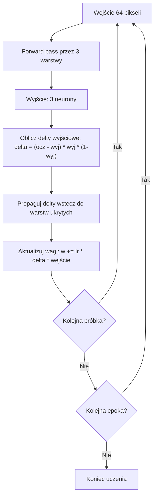

# Aplikacja do rozpoznawania literek E, F, Z (MLP + Backpropagation)

## Stan obecny

Istniejące klasy (`Neuron`, `Warstwa`, `Siec`) implementują jedynie forward pass. `Test.java` to demo wizualizacji 2D — zostanie zastąpiony nowym GUI. Trzeba dodać backpropagation i nowy interfejs.

## Topologia sieci

```
64 wejścia (siatka 8x8) → [8 neuronów] → [5 neuronów] → [3 neurony wyjściowe]
```

Wyjścia: `[E, F, Z]` — one-hot encoding, np. E = `[1, 0, 0]`, F = `[0, 1, 0]`, Z = `[0, 0, 1]`.

## Zmiany w istniejących klasach

### 1. Neuron.java

- Przełączyć inicjalizację wag na mały zakres (`*0.01` zamiast `*10`) — odkomentować linię 21, zakomentować linię 20.
- Dodać pole `double wyjscie` — przechowuje ostatni wynik (potrzebne do obliczenia pochodnej sigmoidy przy backprop).
- Zmodyfikować `oblicz_wyjscie()` tak, by zapisywało wynik do `this.wyjscie` przed `return`.
- Dodać pole `double delta` — błąd neuronu podczas backpropagation.

### 2. Warstwa.java

- Dodać pole `double[] ostatnieWejscia` — zapamiętuje wejścia warstwy (potrzebne przy aktualizacji wag).
- Zmodyfikować `oblicz_wyjscie()` żeby zapisywało `ostatnieWejscia = wejscia`.

### 3. Siec.java

- Dodać pole `double[] pierwszeWejscia` — zapamiętuje oryginalne wejścia sieci.
- Zmodyfikować `oblicz_wyjscie()` aby zapisywało `pierwszeWejscia`.
- Dodać metodę `void ucz(double[] wejscia, double[] oczekiwane, double lr)` implementującą **backpropagation**:
  1. **Forward pass** — `oblicz_wyjscie(wejscia)`
  2. **Oblicz delty warstwy wyjściowej** — dla każdego neuronu `i` w ostatniej warstwie:
     ```java
     double o = neuron.wyjscie;
     neuron.delta = (oczekiwane[i] - o) * o * (1.0 - o);
     ```
  3. **Propaguj delty wstecz** — dla warstw ukrytych (od przedostatniej do pierwszej): delta neuronu `j` w warstwie `l` = `o * (1 - o) * Σ(delta_k * waga_k_j)` (sumowanie po neuronach warstwy `l+1`).
  4. **Aktualizuj wagi** — dla każdej warstwy, każdego neuronu:
     ```java
     wagi[0] += lr * delta;              // bias
     wagi[i] += lr * delta * wejscie[i-1]; // reszta wag
     ```
- Dodać metodę `void uczEpoka(double[][] dane, double[][] oczekiwane, double lr)` — iteruje po wszystkich próbkach.

## Nowy GUI — Test.java (przebudowa)

Przebudować `Test.java` na aplikację Swing. Okno podzielone na dwie kolumny (lewy panel + prawy panel). Lewy panel podzielony horyzontalnie na dwie sekcje.

### Layout okna

```
┌───────────────────────────────────────┬───────────────────────────────────────┐
│  LEWY PANEL                          │  PRAWY PANEL                          │
│                                       │                                       │
│  ┌─ GÓRA (rysowanie + zgadywanie) ──┐│  ┌──────────────────────────────────┐ │
│  │                                   ││  │         Panel logów              │ │
│  │  ┌────────────┐                   ││  │  (JTextArea + JScrollPane)       │ │
│  │  │            │  [Zgadnij]       ││  │  auto-scroll na dół              │ │
│  │  │  Siatka    │  [Wyczyść]       ││  └──────────────────────────────────┘ │
│  │  │  8 x 8     │                   ││                                       │
│  │  │            │  Wynik: E         ││  ┌─ Wyjścia sieci ─────────────────┐ │
│  │  └────────────┘                   ││  │  ● E: 0.97   ○ F: 0.03   ○ Z: 0.01│
│  └───────────────────────────────────┘│  └──────────────────────────────────┘ │
│                                       │                                       │
│  ┌─ DÓŁ (uczenie + testowanie) ─────┐│  ┌──────────────┐  ┌──────────────┐  │
│  │                                   ││  │ Wykres MSE   │  │ Wykres acc.  │  │
│  │  Epoki: [========■====] 1000     ││  │ (uczenie)    │  │ (testowanie) │  │
│  │  [Ucz]          [Testuj]         ││  │ line chart   │  │ bar chart    │  │
│  │                                   ││  └──────────────┘  └──────────────┘  │
│  │  ○ E  ○ F  ○ Z                   ││                                       │
│  │  [Dopisz do ciągu uczącego]      ││                                       │
│  └───────────────────────────────────┘│                                       │
└───────────────────────────────────────┴───────────────────────────────────────┘
```

### Lewy panel — góra (rysowanie + zgadywanie)

- **Siatka 8x8** — `JPanel` z `GridLayout(8,8)`. Każda komórka to klikalna kratka (`MouseListener`), klik przełącza biały (0) ↔ czarny (1). Wewnętrznie `int[8][8]`.
- **Przycisk "Zgadnij"** — pobiera siatke jako `double[64]` → `siec.oblicz_wyjscie()` → sprawdza próg 0.5.
- **Przycisk "Wyczyść"** — zeruje siatkę 8x8 (obok Zgadnij).
- **Label "Wynik"** — wyświetla rozpoznaną literę lub "Nie rozpoznano".

### Lewy panel — dół (uczenie + testowanie + dopisywanie)

- **Slider epok** — `JSlider` zakres 100–10000, domyślnie 1000, krok 100. Obok `JLabel` z aktualną wartością (aktualizowany `ChangeListener`).
- **Przycisk "Ucz"** — wczytuje `dane_uczace.csv`, uruchamia uczenie w `SwingWorker` (nie blokuje GUI). Po zakończeniu — `JOptionPane.showMessageDialog` z podsumowaniem (epoki, MSE końcowe, czas).
- **Przycisk "Testuj"** — wczytuje `dane_testowe.csv`, forward pass, liczy accuracy per klasa. Po zakończeniu — `JOptionPane.showMessageDialog` z wynikiem (E=X%, F=X%, Z=X%, TOTAL=X%).
- **Radio buttony E/F/Z + "Dopisz"** — pobiera siatkę + wybraną literę → dopisuje wiersz do `dane_uczace.csv`.

### Prawy panel — panel logów

- `JTextArea` (nieedytowalny) w `JScrollPane`, auto-scroll na dół.
- Metoda `log(String msg)` dopisuje linię z timestampem `[HH:mm:ss]`.
- Przykładowe wpisy:
  - `[12:34:56] Start uczenia, epoki=1000, lr=0.1`
  - `[12:34:56] Epoka 100/1000, MSE=0.0342`
  - `[12:34:57] Koniec uczenia, MSE końcowe=0.0012`
  - `[12:34:58] Test: E=100%, F=80%, Z=100%, TOTAL=93%`
  - `[12:34:59] Zgadywanie: [0.98, 0.01, 0.03] -> E`

### Prawy panel — wyjścia neuronów

Kompaktowy panel pokazujący wartości 3 neuronów wyjściowych po kliknięciu "Zgadnij":

```
● E: 0.97    ○ F: 0.03    ○ Z: 0.01
```

- Kropka zwycięzcy — zielona wypełniona (`fillOval`) przy neuronie z najwyższą wartością > 0.5.
- Reszta — szare puste kółka (`drawOval`).
- Jeśli żaden > 0.5 — wszystkie kropki czerwone (nie rozpoznano).
- Implementacja: `JPanel` z `paintComponent` — trzy `fillOval`/`drawOval` + `drawString` dla etykiet i wartości.

### Prawy panel — wykres uczenia (MSE per epoka)

- **Line chart** — średni MSE po każdej epoce, krzywa opadająca = sieć się uczy.
- Klasa `WykresPanel extends JPanel` z `ArrayList<Double>`.
- `paintComponent`: osie (`drawLine`), etykiety (`drawString`), punkty łączone linią łamaną.
- MSE obliczane: `Σ(oczekiwane - wyjście)² / (liczbaPróbek * liczbaWyjść)`.
- Wymaga zmiany sygnatury `uczEpoka()` na zwracającą `double` (MSE).
- Aktualizacja co N epok + `repaint()`.

### Prawy panel — wykres testowania (accuracy per klasa)

- **Bar chart** — 4 słupki: E, F, Z, TOTAL (% poprawnych klasyfikacji).
- Ten sam wzorzec `WykresPanel`, ale rysuje `fillRect` + etykiety + wartości procentowe.
- Aktualizacja po kliknięciu "Testuj".

### Uczenie w osobnym wątku

- `SwingWorker` — pętla po epokach w `doInBackground()`, aktualizacja logów i wykresu przez `publish()`/`process()`.
- Przycisk "Ucz" wyłączany na czas uczenia, włączany po zakończeniu.
- Po zakończeniu — `JOptionPane` z podsumowaniem.

## Format CSV

Plik `dane_uczace.csv` i `dane_testowe.csv`:

```
0,0,1,1,1,0,0,0,0,1,0,0,...(64 wartości)...,E
1,0,0,1,0,0,...(64 wartości)...,F
```

Każdy wiersz: 64 wartości (0/1) + etykieta (E/F/Z). Konwersja etykiety na one-hot w kodzie.

## Pliki CSV z danymi

Przygotować po kilka wzorcowych próbek literek E, F, Z na siatce 8x8 (ręcznie) w `dane_uczace.csv` i `dane_testowe.csv`, żeby było na czym trenować i testować od razu.

## Obsługa nierozpoznania

W "Zgadnij": jeśli **żaden** neuron wyjściowy nie przekracza progu 0.5 — wyświetlamy "Nie rozpoznano". Jeśli jeden przekracza — to nasza odpowiedź. Jeśli kilka przekracza — bierzemy ten z największą wartością.

## Diagram przepływu backpropagation


